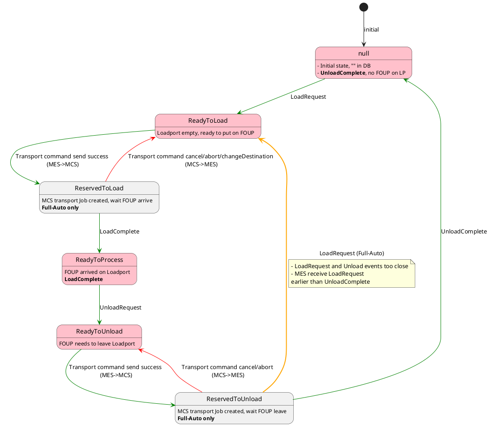
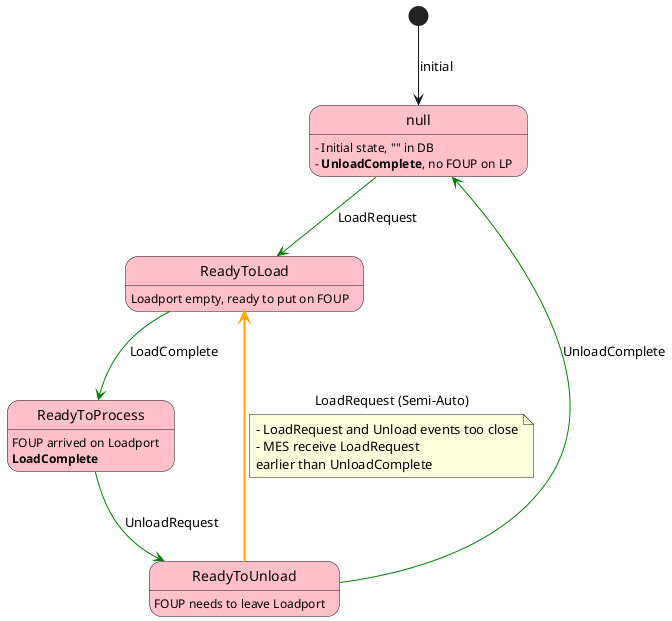
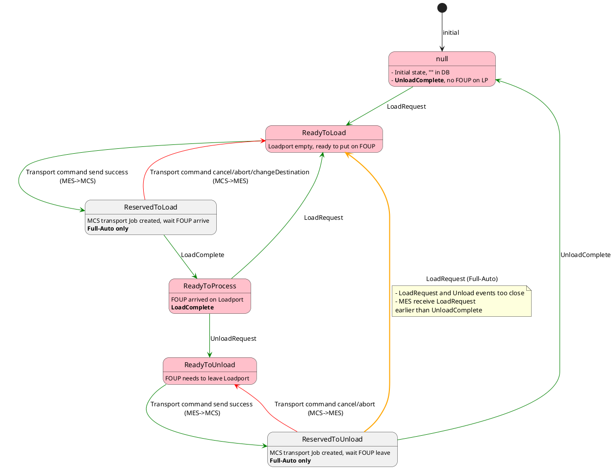
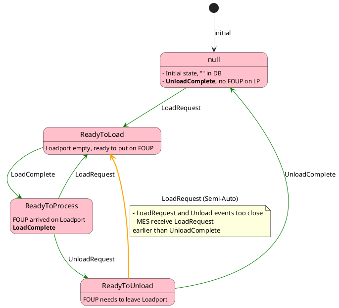

## Full-Auto (FixBuffer)

## Semi-Auto (FixBuffer)

## Full-Auto (InternalBuffer)
#TODO

## Semi-Auto (InternalBuffer)

# State description
| State            | Description                                              |
|:---------------- |:-------------------------------------------------------- |
| null             | Initial state, UnloadComplete                                            |
| ReadyToLoad      | Loadport empty, wait put on FOUP                         |
| ReservedToLoad   | MCS job to put on FOUP created.
Wait AMHS
      |
| ReadyToProcess   | FOUP already on Loadport.
Wait Process
         |
| ReadyToUnload    | Wafer process completed, wait to be removed fromLoadport |
| ReservedToUnload | MCS job to remove FOUP created.
Wait AMHS
      |
 
